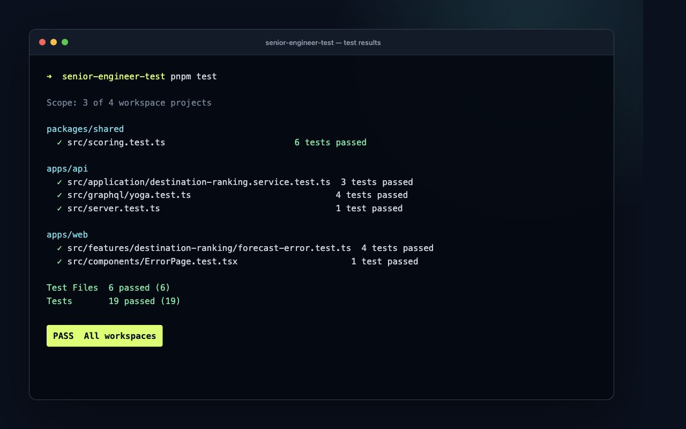

# Daymark

Daymark turns a seven-day weather forecast into explainable rankings for skiing, surfing, outdoor sightseeing, and indoor sightseeing.

The project was created for the Lead/Senior Engineer take-home exercise. It prioritises transparent domain rules, replaceable external integrations, and a polished but focused user experience.

## Product walkthrough

[]

## Run locally

Requirements:

- Node.js 20.19 or newer
- pnpm 11 or newer

```bash
pnpm install
pnpm dev
```

- Web application: http://localhost:5173
- GraphQL API: http://localhost:4000/graphql

The application opens with Lisbon as a useful coastal example. Search for any city or town to generate another ranking.

## Useful commands

```bash
pnpm typecheck
pnpm test
pnpm lint
pnpm build
```

## Run the tests

From the repository root, run every test suite with:

```bash
pnpm test
```

Run one workspace independently when developing a specific layer:

```bash
pnpm --filter @app/shared test
pnpm --filter @app/api test
pnpm --filter @app/web test
```

The latest complete run passes all 19 tests across the shared domain, API, and frontend workspaces:



## Architecture overview

Daymark is a pnpm monorepo containing independently buildable frontend and backend applications:

```text
apps/
├── api/src/
│   ├── application/       Use case, provider ports, and error types
│   ├── graphql/           Schema, resolvers, and GraphQL Yoga boundary
│   ├── infrastructure/    Open-Meteo provider adapters and validation
│   ├── server.ts          HTTP server composition
│   └── index.ts           Process entry point
└── web/src/
    ├── components/        Focused single-page UI sections and widgets
    ├── features/          Destination search and forecast state
    ├── graphql/           Client, operation, and response types
    ├── lib/               Presentation mappings and formatters
    ├── App.tsx            Single-page composition
    └── main.tsx           Browser entry point
packages/shared/           Domain models and activity scoring strategies
```

The applications share a repository for reviewer convenience, consistent tooling, and atomic contract changes. They remain separate runtime processes and communicate only through GraphQL, so they can be deployed and scaled independently.

The backend follows a lightweight hexagonal structure:

1. The GraphQL resolver receives a task-oriented destination request.
2. The application service coordinates geocoding, forecasts, and ranking.
3. Open-Meteo adapters translate external responses into the internal weather model.
4. Pure activity strategies score each day without knowing about HTTP or GraphQL.

This keeps the important business rules independent from framework and provider choices without introducing unnecessary enterprise ceremony.

The frontend follows the same separation at a smaller scale. `App.tsx` composes the page, feature hooks own user interaction and API state, GraphQL files define the remote boundary, and presentational components receive typed props. This keeps individual pieces readable and testable while avoiding routing or global state that a single-page experience does not need.

## Technical choices

### React and Vite

React matches the requested stack. Vite provides a small, fast development and production setup without requiring a larger full-stack framework when the API is intentionally separate.

### GraphQL Yoga

GraphQL is required by the brief. Yoga provides a standards-focused Node.js implementation with a small API surface. The client requests one complete destination-ranking view rather than coordinating multiple low-level weather requests.

### urql

urql is a compact React GraphQL client that provides request lifecycle and caching behaviour without excessive client-side infrastructure.

### Zod at external boundaries

TypeScript cannot validate runtime responses. The Open-Meteo adapters validate geocoding, weather, and marine data before translating it into domain objects.

### Pure scoring strategies

Each activity has an independent, deterministic scorer that returns:

- A score from 0 to 100
- A qualitative rating
- Human-readable reasons

Pure functions make the scoring assumptions visible, independently testable, and easy to adjust or replace.

### No database

There is no durable application-owned data in the current use case. Forecasts become stale, Open-Meteo is the source of truth, and there are no accounts or saved preferences. Adding a database would increase setup and operational complexity without supporting a requirement.

A database would become appropriate for accounts, saved destinations, personal scoring preferences, or historical comparisons.

## Data flow

1. The user submits a city or town.
2. The API validates the input and uses Open-Meteo geocoding to resolve a location.
3. Weather and marine forecasts are retrieved concurrently.
4. External responses are validated and converted into the domain model.
5. Four independent strategies score and rank every day.
6. GraphQL returns the resolved location, forecast, rankings, and explanations.
7. React presents the seven-day comparison and detailed selected-day view.

## Scoring approach

The scores are intentionally understandable rather than presented as scientific predictions:

- **Skiing:** snowfall, temperature suitability, wind, and gusts.
- **Surfing:** wave height, wave period, and wind where marine data is available.
- **Outdoor sightseeing:** temperature comfort, precipitation, sunshine, and wind.
- **Indoor sightseeing:** weather resilience, with rain and temperature extremes increasing its relative desirability.

Surfing deserves particular caution: a city-level marine forecast does not replace local knowledge, tide information, beach-specific conditions, or safety guidance. The UI identifies all scores as directional guidance.

## Error handling

- Short or invalid searches are rejected before external calls with a typed `BAD_USER_INPUT` response.
- Unknown destinations return a typed `NOT_FOUND` response and a useful user-facing message.
- External requests have timeouts.
- Unexpected provider shapes are rejected during validation.
- Marine data is optional so an inland forecast can still succeed.
- Provider failures become retryable `UPSTREAM_SERVICE_UNAVAILABLE` responses.
- Internal errors are masked at the GraphQL boundary and return HTTP 500 without exposing implementation details.
- Unknown API paths return the same structured JSON error shape with HTTP 404.
- Unknown frontend routes render a branded 404 page, while 5xx forecast failures render a retryable service-error view.

## Testing strategy

Testing concentrates on the highest-risk logic and boundaries rather than low-value snapshots. The suite covers:

- Activity scoring, score bounds, and ranking order
- Application-service validation, provider orchestration, and error propagation
- GraphQL 400, 404, 500, and 503 contracts, including internal-error masking
- The API's JSON 404 response for unknown routes
- Frontend error classification for client, not-found, network, and server failures
- Rendering and recovery navigation for unknown frontend routes

The final repository is also checked with strict TypeScript, ESLint, and production builds for both applications.

## Engineering approach and AI collaboration

I used AI throughout the exercise as a practical engineering accelerator. My contributions and decisions included:

- Interpreting the brief and defining the product journey from destination search to explainable activity recommendations
- Comparing three architecture options: a single full-stack application, separate repositories, and a monorepo with independently deployable applications
- Selecting the monorepo approach to combine reviewer convenience, shared tooling, atomic contract changes, and a clear frontend/API boundary
- Choosing a domain-first delivery sequence: weather model and scoring rules, GraphQL API, then the frontend experience
- Designing a lightweight hexagonal backend that separates business rules, application orchestration, GraphQL, and external providers
- Structuring the React application around focused components, feature state, and a typed GraphQL boundary
- Choosing not to add a database because the current use case has no durable application-owned data
- Defining the error-handling, validation, testing, responsive-design, and production-scaling approach
- Reviewing and refining the implementation through live API requests, manual UI checks, automated tests, strict TypeScript, linting, and production builds

AI supported delivery by:

- Providing architecture alternatives and trade-offs for evaluation
- Accelerating project scaffolding and repetitive implementation work
- Assisting with Open-Meteo integration, test-case generation, and troubleshooting
- Helping translate the visual direction into a responsive interface
- Reviewing implementation details and supporting the documentation

## Omissions and trade-offs

- **Location disambiguation:** the API currently uses the strongest geocoding match. A production interface should let users choose between places with the same name.
- **Shared cache:** repeated forecasts are not cached. A production implementation would add a cache port and Redis-backed adapter with separate TTLs for geocoding and weather.
- **Personal preferences:** all users receive the same scoring rules. Weight profiles could support preferred temperatures, experience level, and accessibility requirements.
- **Broader tests:** the current suite covers the domain, application service, GraphQL and HTTP error boundaries, and frontend error presentation. More time would add Open-Meteo adapter contract tests and a browser-level happy path.
- **Surf precision:** marine data is coordinate based and may not represent a specific surf break. A specialist provider and tide data would improve this recommendation.
- **Authentication and persistence:** intentionally omitted because the brief has no user-owned data.

## Production scaling

The API is stateless and can run behind a load balancer with multiple instances. Static frontend assets can be served globally through a CDN. A shared Redis cache would reduce provider traffic and latency, while request coalescing would prevent many identical upstream calls after cache expiry.

At higher scale, the system should add rate limits, GraphQL complexity limits, request tracing, cache-hit metrics, upstream latency monitoring, circuit breakers, and carefully bounded stale-forecast fallback. The provider interfaces allow those infrastructure changes without rewriting scoring logic or the client contract.

## Data source

Weather, geocoding, and marine forecasts are provided by [Open-Meteo](https://open-meteo.com/).
